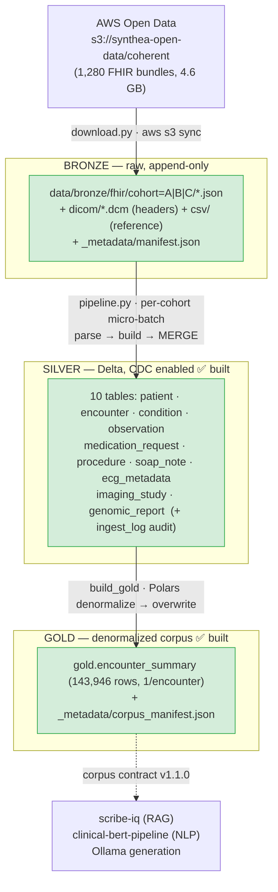

# Architecture (as-built)

This describes what **currently exists** in the repo. For the intended end-state design,
see [scribe-iq-lakehouse-spec.md](roadmap/scribe-iq-lakehouse-spec.md); for *why* things
are the way they are, see the [ADRs](adr/README.md). This file is updated when the
structure changes — it tracks reality, not the plan.

## Overview

A medallion healthcare lakehouse on Synthea Coherent (synthetic FHIR R4). Per
**ADR-022** the lakehouse runs as **two independent end-to-end implementations** that
emit the same Gold corpus contract: a LocalLite tier (`core/` — Polars + delta-rs)
and a Fabric tier (`fabric/` — Spark + OneLake Delta), each with its own Silver,
Gold, and validation stack written engine-native. Today the **Bronze → Silver → Gold**
path is fully built on both tiers — locally it runs end-to-end on the full
1,278-patient dataset (143,946 encounter summaries) via the `core.surfaces.cli.pipeline`
CLI or a **Dagster** software-defined asset graph (ADR-015/016); on Fabric it ran
green end-to-end on F4 capacity against a 100-patient demo sample via notebooks 00–10.



The LocalLite tier runs under **two local execution surfaces** (ADR-015/016): the
dependency-light `core.surfaces.cli.pipeline` CLI and a **Dagster** asset graph
(cohorts = partitions, `validate_table` = asset checks, sensor watches
`data/bronze/fhir/`). The Fabric tier runs under its own independent execution
surface — `fabric/notebooks/00–10` (`.Notebook/notebook-content.py` source-of-truth,
ADR-021), each instantiating `FabricPlatform()` directly. The orchestration / notebook
tiers import the per-tier transforms and platform — neither tier imports the other.

For **read-only exploration** the same Delta tables are queryable from a
**DuckDB UI notebook** ([`docs/demo/notebooks/demo_notebook.sql`](demo/notebooks/demo_notebook.sql))
— 20 cells over Silver/Gold via `delta_scan(...)`, no Spark. The Dagster asset
metadata and the CLI walkthrough ([`core/scripts/demo_walkthrough.py`](../core/scripts/demo_walkthrough.py))
both render via [`local/preview.py`](../local/preview.py), so the same data
shape appears in the UI, the terminal, and the SQL notebook — one set of
renderers, three audiences. Recording guide: [`docs/demo/PLAYBOOK.md`](demo/PLAYBOOK.md).

## Layers (as-built)

| Layer | State | Storage | Notes |
|-------|-------|---------|-------|
| Bronze | ✅ built (local) | raw JSON, cohort-partitioned | append-only; `_metadata/manifest.json` provenance |
| Silver | ✅ built (local) | 10 Delta tables + `ingest_log` | CDC enabled; validated; MERGE-upsert per cohort |
| Gold | ✅ built (local) | `encounter_summary` Delta + manifest | 1 row/encounter; CDC; as-of-date problem list; corpus contract v1.1.0 (ADR-012/014) |
| Dagster orchestration | ✅ built (local) | `core/orchestration/dagster/` package | medallion as asset graph; cohort partitions; `validate_table` as asset checks (ADR-015/016) |
| Fabric execution | ✅ green end-to-end (F4, SAMPLE_SIZE=100) | OneLake | independent Spark-native impl (ADR-022); notebooks 00–10; anonymous S3 ingest in 01; full 1,278-bundle re-run pending |

## Module map

```
local/
  platform/        I/O abstraction — the ONLY place engine-specific code lives (ADR-002)
    base.py          LakehousePlatform ABC; Arrow is the interchange type (ADR-004)
    factory.py       LAKEHOUSE_PLATFORM env var → implementation (default local_lite)
    local_lite.py    Polars + delta-rs: Delta write/read, CDC, MERGE upsert (ADR-003/009)
  transforms/      Pure, platform-free record extraction → Arrow (returns pa.Table)
    fhir_parser.py   FHIRBundleParser — dict-based, all extract_* methods (ADR-008)
    schema_utils.py  Field-type-driven Arrow coercion (UTC ts, date32, string codes)
    silver_*.py      One module per Silver table; explicit schemas
    registry.py      table → (schema, primary_key, build_fn) — single source of truth
  gold/            Pure Gold denormalization → Arrow (Polars join engine, ADR-012)
    encounter_summary.py  Silver → gold.encounter_summary; GOLD_SCHEMA + corpus contract
    corpus_manifest.py    Lineage + coverage stats → gold/_metadata/corpus_manifest.json
  validation/      schema_registry.py (rules) + validate.py → silver.ingest_log
  ingest/          download.py (S3 sync: FHIR cohorts + DICOM/CSV assets) · bronze_landing
    dicom_index.py   StudyInstanceUID → .dcm path; resolver feeding DICOM headers (ADR-013)
    streaming_sim.py cohort replay + watchdog (Auto Loader analogue)
  pipeline.py      Bronze → Silver → Gold orchestration (run_pipeline · build_gold)
  redaction.py     PHI-safe log references (ADR-010)
  preview.py       Markdown renderers for data shape (schema/sample/bundle/encounter card) —
                   shared by Dagster asset metadata and core/scripts/demo_walkthrough.py
orchestration/   Dagster asset graph — third execution surface; imports local/, never reverse (ADR-015/016)
  assets.py        bronze_fhir → silver_tables (@multi_asset, parse-once → 10 nodes) → gold_encounter_summary;
                   each MaterializeResult carries rendered metadata (schema + sample rows + sample bundle / SOAP card)
  checks.py        @asset_check per Silver table wrapping validate_table() — UI shows rule-by-rule pass/fail table
  partitions.py    DynamicPartitionsDefinition — cohorts = partitions (per-cohort backfill)
  resources.py     PlatformResource → get_platform(LAKEHOUSE_PLATFORM); platform persists, not IOManager
  sensors.py       bronze_cohort_sensor — watches data/bronze/fhir/cohort=* (Auto Loader analogue);
                   target = bronze_fhir + 10 Silver assets (full chain per cohort, Gold stays manual)
  definitions.py   Definitions(assets, asset_checks, sensors, resources)
scripts/
  gen_data_dictionary.py   Generates docs/DATA_DICTIONARY.md from the registry (ADR-011)
  gen_corpus_schema.py     Generates schemas/gold_encounter_summary.json from GOLD_SCHEMA (ADR-012)
  demo_walkthrough.py      One-patient Bronze → Parse → Silver → Gold tour (rich CLI; same renderers as Dagster UI)
docs/demo/
  PLAYBOOK.md               Demo video recording guide (5-beat structure, takes, edit, publish)
  notebooks/
    demo_notebook.sql       20-cell DuckDB UI source — corpus headlines, top conditions, SOAP notes, lineage
    README.md               How to open / regenerate the .duckdb (gitignored)
```

## Key properties (and where enforced)

- **Platform portability** — transforms never import platform/Spark/Delta/`dagster`; one env
  var switches engines. Enforced by `.claude/rules/transforms.md` + tests (ADR-002, ADR-015).
- **Arrow interchange** — every transform returns an explicitly-typed `pa.Table` (ADR-004).
- **CDC everywhere** — `delta.enableChangeDataFeed=true` on table creation (ADR-009).
- **Honest data modeling** — genomic `data_limitation` is a first-class column (ADR-007);
  DICOM headers without pixels (ADR-006); validation rules match Coherent reality, e.g.
  SOAP completeness checks S/A/P (no Objective section exists) (ADR-005/009).
- **PHI-safe logging** — identifiers are redacted to `ref:<hash>` in logs (ADR-010).

## Current scale (full local run)

1,280 bundles (1,278 patients) → 10 Silver Delta tables in **~2m30s**, then →
**143,946** `gold.encounter_summary` rows in **~6.5s** on a single laptop, all validations passing.
Per-table counts, corpus coverage, and methodology: [BENCHMARKS.md](BENCHMARKS.md). Operational
procedures: [RUNBOOK.md](RUNBOOK.md). The Gold corpus contract is documented in
[CORPUS_CONTRACT.md](CORPUS_CONTRACT.md).
