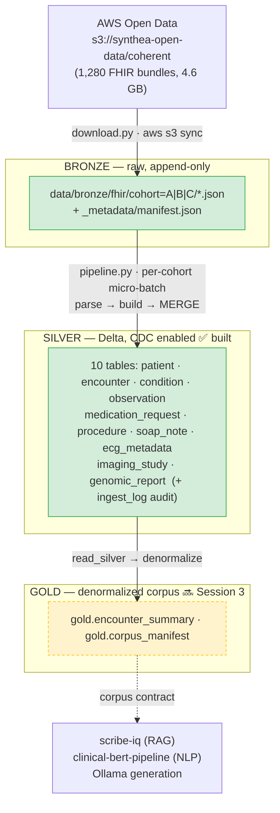

# Architecture (as-built)

This describes what **currently exists** in the repo. For the intended end-state design,
see [scribe-iq-lakehouse-spec.md](roadmap/scribe-iq-lakehouse-spec.md); for *why* things
are the way they are, see the [ADRs](adr/README.md). This file is updated when the
structure changes — it tracks reality, not the plan.

## Overview

A medallion healthcare lakehouse on Synthea Coherent (synthetic FHIR R4). Engine-agnostic
**pure transforms** return Apache Arrow tables; a **platform abstraction** handles all I/O
so the same code runs locally (Polars + delta-rs) or on Microsoft Fabric. Today the
**Bronze → Silver** path is fully built and runs end-to-end on the full 1,278-patient
dataset locally; **Gold** and **Fabric execution** are next.



## Layers (as-built)

| Layer | State | Storage | Notes |
|-------|-------|---------|-------|
| Bronze | ✅ built (local) | raw JSON, cohort-partitioned | append-only; `_metadata/manifest.json` provenance |
| Silver | ✅ built (local) | 10 Delta tables + `ingest_log` | CDC enabled; validated; MERGE-upsert per cohort |
| Gold | 🔜 Session 3 | Delta | `encounter_summary` (1 row/encounter) + `corpus_manifest` |
| Fabric execution | 🔜 Session 4 | OneLake | notebooks 00–10; S3 shortcut; same transforms |

## Module map

```
local/
  platform/        I/O abstraction — the ONLY place engine-specific code lives (ADR-002)
    base.py          LakehousePlatform ABC; Arrow is the interchange type (ADR-004)
    factory.py       LAKEHOUSE_PLATFORM env var → implementation (default local_lite)
    local_lite.py    Polars + delta-rs: Delta write/read, CDC, MERGE upsert (ADR-003/009)
  transforms/      Pure, platform-free record extraction → Arrow (returns pa.Table)
    fhir_parser.py   FHIRBundleParser — dict-based, all extract_* methods (ADR-008)
    schema_utils.py  Field-type-driven Arrow coercion (UTC ts, date32, string codes)
    silver_*.py      One module per Silver table; explicit schemas
    registry.py      table → (schema, primary_key, build_fn) — single source of truth
  validation/      schema_registry.py (rules) + validate.py → silver.ingest_log
  ingest/          download.py (S3 sync + cohort partition) · bronze_landing · streaming_sim
  pipeline.py      Bronze → Silver orchestration (per-cohort micro-batch)
  redaction.py     PHI-safe log references (ADR-010)
scripts/
  gen_data_dictionary.py   Generates docs/DATA_DICTIONARY.md from the registry (ADR-011)
```

## Key properties (and where enforced)

- **Platform portability** — transforms never import platform/Spark/Delta; one env var
  switches engines. Enforced by `.claude/rules/transforms.md` + tests (ADR-002).
- **Arrow interchange** — every transform returns an explicitly-typed `pa.Table` (ADR-004).
- **CDC everywhere** — `delta.enableChangeDataFeed=true` on table creation (ADR-009).
- **Honest data modeling** — genomic `data_limitation` is a first-class column (ADR-007);
  DICOM headers without pixels (ADR-006); validation rules match Coherent reality, e.g.
  SOAP completeness checks S/A/P (no Objective section exists) (ADR-005/009).
- **PHI-safe logging** — identifiers are redacted to `ref:<hash>` in logs (ADR-010).

## Current scale (full local run)

1,280 bundles (1,278 patients) → 10 Silver Delta tables in **2m30s** on M1 Max, all
validations passing. Per-table counts and methodology: [BENCHMARKS.md](BENCHMARKS.md).
