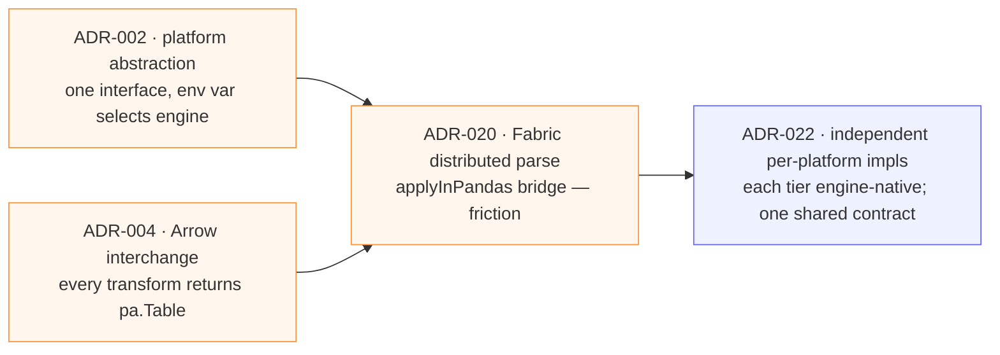

# Design Notes

The interesting problems — narrated, with the trade-offs. Each links the ADR that records the
decision.

## 1. SOAP notes are Base64 inside FHIR `Binary` — decode, don't parse ([ADR-005](adr/005-fhir-binary-decode.md))

Coherent's clinical notes aren't a separate file format; they're Base64-encoded text inside
`Binary` resources, linked to encounters via `DocumentReference`. The right extraction is a
**decode step**, not a CCDA/section parser. One consequence worth stating honestly: Synthea SOAP
notes contain **S/A/P** but no **Objective** section, so the Silver completeness check validates
S/A/P only — the validation matches reality rather than an idealized template.

## 2. DICOM: extract headers, never pixels ([ADR-006](adr/006-dicom-stop-before-pixels.md) · [013](adr/013-dicom-ingest-and-linkage.md))

`pydicom.dcmread(..., stop_before_pixels=True)` everywhere. Imaging metadata (modality, body
site, series, dimensions) enriches the encounter; pixel arrays are deliberately never loaded —
fast, lightweight, and the correct scope when the goal is encounter context, not radiology
inference. FHIR `ImagingStudy` is authoritative for the 3,752 studies; the 298 with a downloaded
`.dcm` add real header dimensions. Coherent's descriptive DICOM tags are placeholder `"UNKNOWN"`,
normalized to null — so grounding uses `modality` + `body_site_display`, not a study description.

## 3. The as-of-date problem list ([ADR-014](adr/014-problem-list-as-of-date.md))

The decision that most demonstrates clinical-data-temporality judgment. A naive encounter-grain
join left the **majority** of encounters with an empty problem list. Recomputing
`active_conditions` as the patient's problem list **active as of each encounter date** (onset ≤
date, not yet abated) dropped empty problem lists to **0.9%** and lifted average conditions per
encounter to 9.57. Medications get the same as-of-date treatment — but with an honest asterisk:
FHIR has no medication *stop* date, so meds are a forward `status=active` approximation, not a
reconstructable point-in-time timeline ([Responsible Data](responsible-data.md)).

## 4. Dict-based FHIR parsing over typed models ([ADR-008](adr/008-dict-based-fhir-parsing.md))

Parsing uses plain dict access with `.get(...)` defaults rather than `fhir.resources` Pydantic
models. Coherent bundles are large and partially-populated; defensive `.get()` access keeps the
transforms pure, dependency-light, and resilient to missing/optional fields, while explicit Arrow
schemas (not inference) pin the output types. Clinical codes (SNOMED/LOINC/ICD) stay strings,
never cast to numeric.

## 5. Why the platform abstraction was replaced ([ADR-022](adr/022-platform-independent-implementations.md))

The most consequential architecture decision — and a reversal.

The original design routed everything through one `LakehousePlatform` interface with an Arrow
(`pa.Table`) interchange — elegant on the laptop. But making Spark-on-Fabric honor that interface
meant an `applyInPandas` Python bridge that fought Spark's native, distributed `from_json` parsing
([ADR-020](_archive/adr/020-fabric-distributed-parsing.md)). The abstraction was now costing more
than it saved. [ADR-022](adr/022-platform-independent-implementations.md) replaced it with **two
independent, engine-native implementations**: LocalLite returns `pa.Table` (Polars + delta-rs),
Fabric returns Spark DataFrames (Spark + OneLake), and the tiers stay compatible by **schema
parity + lockstep `CONTRACT_VERSION`** — not shared code. Each tier is now idiomatic for its
engine; the Gold contract is the only thing they must agree on. See [Engine Parity](platforms/parity.md).

## 6. Orchestration as a first-class surface ([ADR-015](adr/015-dagster-local-orchestration.md) · [016](adr/016-dagster-asset-graph.md))

The same pure LocalLite transforms run under a dependency-light CLI **and** a Dagster
software-defined asset graph: cohorts become partitions (per-cohort backfill), `validate_table`
becomes an `@asset_check` (rule-by-rule pass/fail in the UI), and a sensor watches
`data/bronze/fhir/` as an Auto-Loader analogue. Each materialization carries rendered metadata
(schema + sample rows + a SOAP card) via the shared `core/preview.py` renderers — the same data
shape shows up in the Dagster UI, the CLI walkthrough, and the DuckDB SQL notebook.
