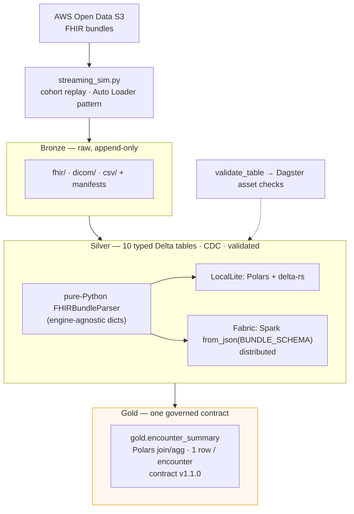
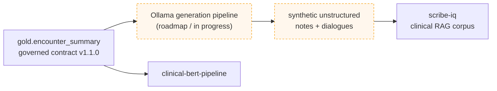

# scribe-iq-lakehouse


This project takes raw, messy, hospital-style patient data and turns it into one clean, reliable,
well-documented dataset that AI systems can safely build on. It's engineered to run the same way on
a laptop or in the cloud, using only synthetic (non-real) patient data.

!!! abstract "For technical reviewers"
    **A production-pattern healthcare data lakehouse: a Bronze → Silver → Gold medallion over
    multimodal [Synthea Coherent](https://registry.opendata.aws/synthea-coherent-data/) FHIR (R4),
    turning raw clinical bundles into one governed, versioned Gold data contract.**

    Built twice, on purpose — **Polars + delta-rs + DuckDB** on a laptop and **Spark + Delta +
    OneLake** on **Microsoft Fabric** — orchestrated as a **Dagster** asset graph, with a
    **streaming-ingest simulation** of Fabric's Auto Loader. Two independent, engine-native
    implementations converge on the *same* contract by schema parity and a lockstep version, not
    shared code ([ADR-022](adr/022-platform-independent-implementations.md)).

> 22 ADRs · 129 fixture-only tests · generated-first docs · three orchestration surfaces · full local run in ~2.5 min.

## Built with

Grouped by concern, so the breadth is visible at a glance:

| Concern | Stack |
|---|---|
| **Compute / transform** | Polars (local, in-process) · Apache Spark (Fabric, distributed) |
| **Storage / format** | Delta Lake — delta-rs locally, OneLake on Fabric · Change Data Feed on every table |
| **Orchestration** | Dagster asset graph · dependency-light CLI · Fabric notebooks + Data Factory |
| **Ingest** | AWS Open Data S3 → append-only Bronze · streaming simulation (Auto Loader pattern) |
| **Explore** | DuckDB (local SQL UI) · Power BI Direct Lake (Fabric) |
| **Data** | Synthea Coherent · FHIR R4 · DICOM headers · genomic reports · synthetic, **no PHI** |

## Why this exists

**`scribe-iq` came first** — it proved the clinical-documentation product on a corpus assembled
*heuristically*: Synthea exported as **CSV**, with clinical notes stitched on from public datasets
(**ACI-Bench, MTSamples, MedSynth**) matched and adapted onto Synthea encounters.

**This repo is the principled rebuild.** The headline engineering decision is
[**ADR-022**](adr/022-platform-independent-implementations.md): the obvious shared-code
abstraction was built first, hit the `applyInPandas` "bridge tax" fighting Spark's native
parsing, and was **deliberately reversed** into two independent, engine-native implementations
that meet only at the contract. On that foundation: a true medallion over **Synthea Coherent
(FHIR R4)** — typed Silver, a semver'd + test-gated Gold contract, multimodal FHIR/DICOM/genomic
handling, and limitations modeled as first-class data.

**Closing the loop (roadmap).** Next, an **Ollama** generation pipeline will consume
`gold.encounter_summary` to derive synthetic unstructured notes and dialogues — the
next-generation corpus for `scribe-iq`, superseding the original heuristic assembly. The arc:
**prototype the product → industrialize the data foundation → generate the corpus from the
governed contract.**

## Start here

<div class="grid cards" markdown>

-   :material-clock-fast:{ .lg .middle } **90-second tour**

    ---

    What this is, how to read it, and what's real vs in-progress.

    [:octicons-arrow-right-24: Reviewer Guide](reviewer-guide.md)

-   :material-source-branch:{ .lg .middle } **Why it's built this way**

    ---

    The dual-engine decision (ADR-022) and the interesting problems.

    [:octicons-arrow-right-24: Engineering Case Study](case-study.md)

-   :material-server-network:{ .lg .middle } **Laptop ↔ Fabric parity**

    ---

    Two engine-native tiers, one contract.

    [:octicons-arrow-right-24: Engine Parity](platforms/parity.md)

-   :material-file-document-outline:{ .lg .middle } **The data contract**

    ---

    The versioned, test-gated Gold handoff (`encounter_summary`, v1.1.0).

    [:octicons-arrow-right-24: Corpus Contract](CORPUS_CONTRACT.md)

</div>

## What this shows

Engineering first; every claim pairs a competence with a checkable number from a real run
([Benchmarks](BENCHMARKS.md), [Corpus Contract](CORPUS_CONTRACT.md)).

| Capability | Evidence (real run) |
|---|---|
| **Multi-platform engine parity** | The same medallion on LocalLite (Polars/delta-rs) and Fabric (Spark/OneLake) — independent implementations, one contract ([ADR-022](adr/022-platform-independent-implementations.md)) |
| **Multiple orchestration surfaces** | The same transforms via CLI · Dagster asset graph (cohort partitions, `validate_table` as asset checks) · Fabric notebooks 00–10 |
| **Streaming-shaped ingest** | Cohort-partition replay simulating Fabric Auto Loader → `core/ingest/streaming_sim.py` |
| **Contract governance** | `gold.encounter_summary` **v1.1.0** — semver + test-gated; downstream consumers pin the major version |
| Healthcare data engineering at scale | 1,280 FHIR bundles (1,278 patients, 4.6 GiB) → 10 typed Silver Delta tables; **669,898** observations |
| Multimodal FHIR handling | Base64 SOAP decode (**100%** coverage), DICOM headers for **298** studies, genomic flags |
| Honest data modeling | as-of-date problem lists (empty lists **0.9%**), genomic `data_limitation` column, PHI-safe logs |
| Quality discipline | **129** tests (no cloud/network), generated docs-as-test, pre-commit security scanning |

## How it fits together

```mermaid
flowchart LR
    S3["AWS Open Data S3<br/>Synthea Coherent · FHIR R4<br/>1,278 patients · ~4.6 GiB"]
    subgraph LH["scribe-iq-lakehouse  (this repo — the data platform)"]
        direction TB
        BR["Bronze<br/>raw, append-only"]
        SV["Silver<br/>10 typed Delta tables · CDC · validated"]
        GD["Gold<br/>gold.encounter_summary · 143,946 rows · 1 / encounter"]
        BR --> SV --> GD
    end
    S3 --> BR
    GD == "corpus contract v1.1.0<br/>versioned · test-gated" ==> C
    subgraph C["Downstream AI consumers"]
        direction TB
        SIQ["scribe-iq<br/>clinical RAG / docs"]
        BERT["clinical-bert-pipeline<br/>NLP"]
        OLL["Ollama pipeline (roadmap)<br/>note + dialogue generation"]
    end
    classDef plat fill:#eef2ff,stroke:#6366f1;
    classDef cons fill:#f0fdf4,stroke:#22c55e;
    classDef road fill:#fff7ed,stroke:#f59e0b,stroke-dasharray:4 3;
    class LH plat
    class C cons
    class OLL road
```



## How it actually runs

The medallion, with the **engine named at every hop**:

- **Bronze** — `core/ingest/download.py` pulls Synthea Coherent from AWS Open Data S3 into an
  append-only, cohort-partitioned landing zone (`fhir/ · dicom/ · csv/` + manifests).
  `streaming_sim.py` replays cohorts to simulate Fabric's **Auto Loader** pattern.
- **Silver** — a pure-Python `FHIRBundleParser` turns bundles into engine-agnostic records; each
  tier then materializes **10 typed, CDC-enabled Delta tables** its own way — LocalLite via
  **Polars + delta-rs**, Fabric via **Spark `from_json(BUNDLE_SCHEMA)`** distributed parsing.
  Validation runs as `validate_table`, surfaced as **Dagster asset checks**.
- **Gold** — a **Polars** join/aggregation denormalizes Silver into a single
  `gold.encounter_summary` (one row per encounter) under the **versioned contract**.

The *same transforms run three ways*: the CLI, the Dagster asset graph, and the Fabric notebooks.



## Two tiers at a glance

| Concern | LocalLite tier (`core/`) | Fabric tier (`fabric/`) |
|---|---|---|
| Compute | Polars (in-process) | Spark |
| Table format / storage | delta-rs (Delta Lake), `data/` | OneLake Delta |
| Parsing | dict-parse → `pa.Table` | `from_json(value, BUNDLE_SCHEMA)` (distributed) |
| Orchestration | CLI · Dagster asset graph | notebooks 00–10 · Data Factory |
| Explore | DuckDB UI (read-only SQL) | Spark `display()` · Power BI Direct Lake |
| Cost (1.3k patients) | $0 | trial (F4) |
| Status | ✅ full 1,278-patient run | ✅ green on 100-patient sample; full re-run pending |

Both are **independent, engine-native implementations** that emit the *same* Gold contract —
compatibility by schema parity + lockstep `CONTRACT_VERSION`, not code sharing. Full detail and
the side-by-side code: [Engine Parity](platforms/parity.md).

## Downstream — closing the loop

`gold.encounter_summary` is the single governed interface between this platform and the AI apps.
**clinical-bert-pipeline** consumes it (the SOAP text plus the structured labels) for NLP. An
**Ollama generation pipeline (roadmap)** will derive synthetic unstructured notes and dialogues
from Gold to become `scribe-iq`'s next corpus — closing the loop from structured contract back to
clinical text. Change the corpus once, behind the contract, and every downstream model inherits it.



→ The full provenance and portfolio arc: [Downstream & Portfolio](portfolio.md).

## Honest boundaries

**Data limitations are modeled as first-class columns, not hidden.** Synthetic data only (Synthea
Coherent — **no PHI**). Genomics is simulated inheritance, flagged in a mandatory `data_limitation`
column; `active_medications` is a forward `status=active` approximation, not a point-in-time
timeline; `has_ecg` is always false (no ECG in the Coherent FHIR). Each limitation is named with
its reason and the production-grade alternative → [Responsible Data](responsible-data.md).

## Run it locally

```bash
python -m venv .venv && source .venv/bin/activate
pip install -e ".[local,dev]"      # Polars + delta-rs + DuckDB + dev tooling
pytest                             # 129 tests — no cloud / Fabric / network
python -m core.surfaces.cli.pipeline --with-gold   # Bronze → Silver → Gold
```

Full procedures — ingest, rebuilds, DICOM, verification, troubleshooting — are in the
[Runbook](RUNBOOK.md). To see one patient flow through the medallion, run
`python -m core.scripts.demo_walkthrough`.

---

Built on Synthea Coherent **synthetic** data — no real patient information. MIT licensed.
A portfolio engineering artifact: see [About](about.md).
