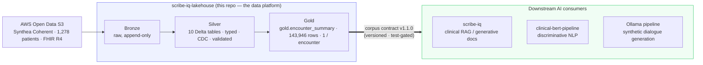

# scribe-iq-lakehouse


**A production-pattern healthcare data lakehouse — raw multimodal FHIR to a governed clinical
data contract, on a laptop _and_ on Microsoft Fabric.**

Bronze → Silver → Gold over **1,278 synthetic** [Synthea Coherent](https://registry.opendata.aws/synthea-coherent-data/)
patients (FHIR R4): 10 typed, CDC-enabled Silver tables → one denormalized Gold corpus,
`gold.encounter_summary` (**143,946 rows**), published under a **versioned, test-gated contract**
that feeds the [scribe-iq](https://sandeep-jay.github.io/scribe-iq/) clinical-RAG and
clinical-bert NLP projects downstream. Two independent engine-native implementations emit the
same contract. **Data limitations are modeled as first-class.** Built to be reviewed as an
engineering artifact.

> 22 ADRs · 129 fixture-only tests · generated-first docs · three orchestration surfaces · full local run in ~2.5 min.

!!! info "Upstream data platform"
    This lakehouse **produces** `gold.encounter_summary` — the governed data foundation
    **consumed** by [scribe-iq](https://sandeep-jay.github.io/scribe-iq/) (clinical RAG),
    clinical-bert-pipeline (NLP), and an Ollama dialogue-generation pipeline.

## Start here

<div class="grid cards" markdown>

-   :material-clock-fast:{ .lg .middle } **90-second tour**

    ---

    What this is, how to read it, and what's real vs in-progress.

    [:octicons-arrow-right-24: Reviewer Guide](reviewer-guide.md)

-   :material-file-document-outline:{ .lg .middle } **The data contract**

    ---

    The versioned, test-gated Gold handoff (`encounter_summary`, v1.1.0).

    [:octicons-arrow-right-24: Corpus Contract](CORPUS_CONTRACT.md)

-   :material-source-branch:{ .lg .middle } **Why it's built this way**

    ---

    Problem → decisions → result, each tied to an ADR.

    [:octicons-arrow-right-24: Engineering Case Study](case-study.md)

-   :material-server-network:{ .lg .middle } **Laptop ↔ Fabric parity**

    ---

    Two engine-native tiers, one contract (ADR-022).

    [:octicons-arrow-right-24: Engine Parity](platforms/parity.md)

</div>

## What this shows

Every claim below pairs a competence with a checkable number from a real run
([Benchmarks](BENCHMARKS.md), [Corpus Contract](CORPUS_CONTRACT.md)).

| Capability | Evidence (real run) |
|---|---|
| Healthcare data engineering at scale | 1,280 FHIR bundles (4.6 GiB) → 10 typed Silver Delta tables; **669,898** observations |
| Governed Gold corpus with a versioned contract | `gold.encounter_summary` — **143,946 rows**, 1/encounter, contract **v1.1.0**, semver + test-gated |
| Fast, laptop-reproducible pipeline | Bronze→Silver **2m19s**; Silver→Gold **~6.5s**; **0 validations failed** |
| Multi-platform engine parity | Same medallion on LocalLite (Polars/delta-rs) and Fabric F4 (Spark/OneLake) — [ADR-022](adr/022-platform-independent-implementations.md) |
| Multiple orchestration surfaces | CLI · Dagster asset graph (cohort partitions, `validate_table` as asset checks) · Fabric notebooks 00–10 |
| Multimodal FHIR handling | Base64 SOAP decode (**100%** coverage), DICOM headers for 298 studies, genomic flags |
| Honest data modeling | as-of-date problem lists (empty lists **0.9%**), genomic `data_limitation` column, PHI-safe logs |
| Quality discipline | **129** tests (no cloud/network), generated docs-as-test, pre-commit security scanning |

## How it fits together



`gold.encounter_summary` is the single governed interface between this platform and the AI
apps — change the corpus once, behind a contract, and every downstream model inherits it.
→ [How this fits the portfolio](portfolio.md).

## The two tiers at a glance

| Concern | LocalLite tier (`core/`) | Fabric tier (`fabric/`) |
|---|---|---|
| Compute | Polars (in-process) | Spark |
| Table format / storage | delta-rs (Delta Lake), `data/` | OneLake Delta |
| Parsing | dict-parse → `pa.Table` | `from_json(value, BUNDLE_SCHEMA)` (distributed) |
| Orchestration | CLI · Dagster asset graph | notebooks 00–10 · Data Factory |
| Explore | DuckDB UI (read-only SQL) | Spark `display()` · Power BI Direct Lake |
| Cost (1.3k patients) | $0 | trial (F4) |
| Status | ✅ full 1,278-patient run | ✅ green on 100-patient sample; full re-run pending |

Both are **independent, engine-native implementations** that emit the *same* Gold contract —
compatibility by schema parity + lockstep `CONTRACT_VERSION`, not code sharing
([ADR-022](adr/022-platform-independent-implementations.md)). See [Engine Parity](platforms/parity.md).

!!! warning "Honest boundaries"
    Synthetic data only (Synthea Coherent — **no PHI**). Genomics is simulated inheritance, not
    clinical variants (flagged in a first-class `data_limitation` column); `active_medications`
    is a forward `status=active` approximation, not a point-in-time timeline; `has_ecg` is always
    false (no ECG in the Coherent FHIR). Every limitation is named, with its reason and the
    production-grade alternative → [Responsible Data](responsible-data.md).

## Run it locally

```bash
python -m venv .venv && source .venv/bin/activate
pip install -e ".[local,dev]"      # Polars + delta-rs + DuckDB + dev tooling
pytest                             # 129 tests — no cloud / Fabric / network
python -m core.surfaces.cli.pipeline --with-gold   # Bronze → Silver → Gold
```

Full procedures — ingest, rebuilds, DICOM, verification, troubleshooting — are in the
[Runbook](RUNBOOK.md). To see one patient flow through the medallion, run
`python -m core.scripts.demo_walkthrough`.

---

Built on Synthea Coherent **synthetic** data — no real patient information. MIT licensed.
A portfolio engineering artifact: see [About](about.md).
