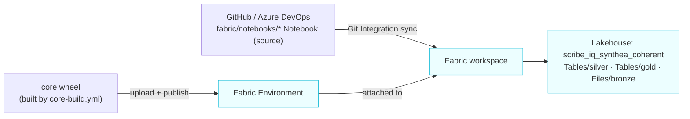

# Fabric Deployment

How the Fabric tier is stood up and kept in sync. The full step-by-step operator runbook lives
in the repo at
[`fabric/docs/DEPLOYMENT.md`](https://github.com/sandeep-jay/scribe-iq-lakehouse/blob/main/fabric/docs/DEPLOYMENT.md);
this page is the architecture summary.

## Deployment model

Two independent channels feed a Fabric workspace — code and library:

- **Notebooks** are synced via **Fabric Git Integration** — the `.Notebook/notebook-content.py`
  source is the single source of truth ([ADR-021](../adr/021-fabric-notebook-source-of-truth.md)),
  and committed notebooks appear in the workspace after a Sync.
- **The `core` wheel** (narrow shared utilities only — Fabric imports `fabric.*`, never the
  LocalLite transforms) is installed via a **Fabric Environment**, built by the same
  `core-build.yml` that publishes it for every tier ([ADR-018](../adr/018-ci-cd-monorepo.md)).

## One-time setup (summary)

1. Create the workspace + a **schema-enabled** Lakehouse (`scribe_iq_synthea_coherent`).
2. Create a Fabric **Environment**, upload the `core` wheel as a custom library, **publish** it
   (publish can take several minutes), and attach it to the workspace/notebooks.
3. Connect **Git Integration** to the repo and Sync so notebooks 00–10 land.
4. Run `00_setup` → `01_bronze_ingest` (anonymous S3) → `02–07` Silver → `08` validation →
   `09` Gold → `10` compare. Or chain them in a Data Factory pipeline for a one-click run.

## Gotchas (the runbook covers these in full)

- **External (Git) repos ≠ Built-in libraries** — the wheel must be added to the *Environment*,
  not expected to arrive via Git.
- **Environment publish time** — publishing a custom library is slow; wait for it before running.
- **Schema-enabled lakehouse required** — the `silver`/`gold` schema namespaces depend on it.
- **Trial-tenant quirks** — `FriendlyNameSupportDisabled` tenants need the lakehouse **GUID** in
  OneLake paths (handled by `FabricPlatform.storage_path()`), never a hardcoded `abfss://` path.

Full procedure, IDs, and REST-automation path:
[`fabric/docs/DEPLOYMENT.md`](https://github.com/sandeep-jay/scribe-iq-lakehouse/blob/main/fabric/docs/DEPLOYMENT.md).
See also [Engine Parity](parity.md) for how this tier relates to LocalLite.
