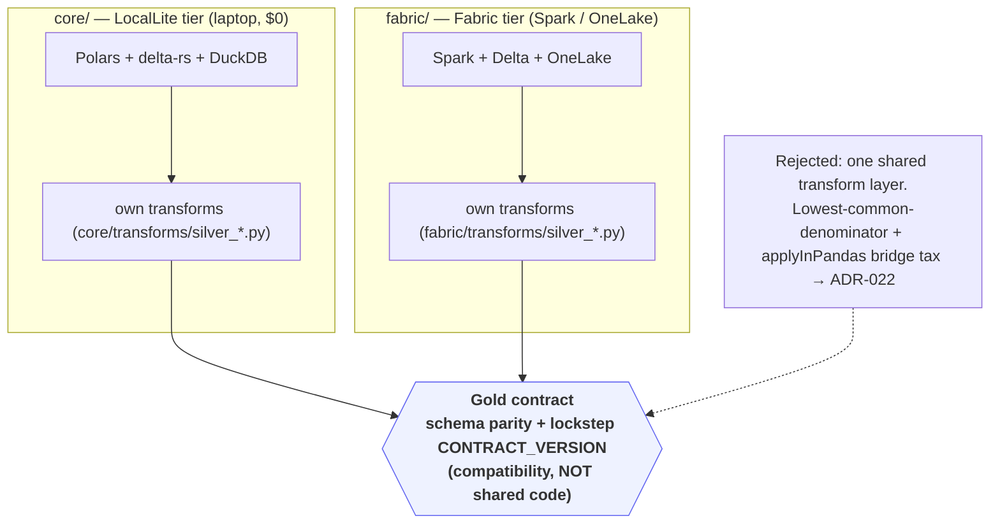
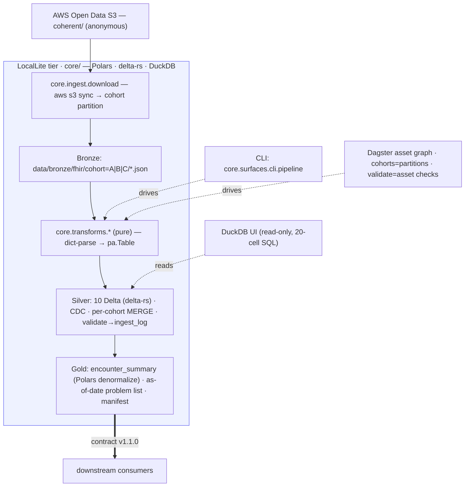

# Multi-Platform Engine Parity (ADR-022)

The lakehouse is implemented **twice** — once for a laptop, once for Microsoft Fabric — as **two
independent, engine-native implementations** that emit the *same* Gold contract. They share no
transform code. Compatibility is guaranteed by **schema parity + a lockstep `CONTRACT_VERSION`**,
enforced by tests ([ADR-022](../adr/022-platform-independent-implementations.md)).

This is the senior-architect decision of the project: an earlier single-abstraction design was
**deliberately replaced** once it started fighting Spark's native parsing — see
[Design Notes §5](../design-notes.md#5-why-the-platform-abstraction-was-replaced-adr-022).

## The two tiers converge on one contract



## LocalLite tier (`core/`)

Pure-Python transforms (dict-parse → explicitly-typed `pa.Table`) over Polars + delta-rs, run by
two local surfaces — a dependency-light CLI and a Dagster asset graph — plus a read-only DuckDB UI.



## Fabric tier (`fabric/`)

Spark-native transforms (`from_json(value, BUNDLE_SCHEMA)` — distributed, no Python bridge) over
OneLake Delta, run by notebooks 00–10 (chained into a Data Factory pipeline), with the `core`
wheel installed via a Fabric Environment and Power BI Direct Lake reading Gold.

```mermaid
flowchart TD
    S3["AWS Open Data S3 (anonymous)"]
    subgraph FAB["Fabric tier · fabric/ — Spark · OneLake Delta"]
        NB1["01_bronze_ingest — anonymous S3 → OneLake"]
        BR["Bronze: Files/bronze/fhir/cohort=* (OneLake)"]
        PARSE["Spark from_json(value, BUNDLE_SCHEMA) — distributed parse"]
        SV["Silver: 10 Delta (OneLake) · CDC · MERGE · single-.agg validation"]
        GD["Gold: encounter_summary (Spark denormalize) + manifest"]
        NB1 --> BR --> PARSE --> SV --> GD
    end
    ENV["Fabric Environment — core wheel installed"] -. utils .-> FAB
    ORCH["notebooks 00–10 (.Notebook, ADR-021) · Data Factory = 1 Run"] -. orchestrate .-> FAB
    PBI["Power BI Direct Lake"] -. reads .-> GD
    S3 --> NB1
    GD ==>|contract v1.1.0 (same shape)| C["downstream consumers"]
    classDef f fill:#ecfeff,stroke:#06b6d4;
    class FAB f
```

## Same step, two engines

The Silver-build step is the clearest illustration of the parity — same registry concept, same
`spec.build(...)`, engine-native return types:

=== "LocalLite (`core/`)"

    ```python
    from core.platform.factory import get_platform
    from core.transforms.registry import SILVER_TABLES

    platform = get_platform()                              # LAKEHOUSE_PLATFORM=local_lite (default)
    records = parse_cohort_bundles(...)                    # pure FHIRBundleParser → dict records
    spec = SILVER_TABLES["patient"]
    table = spec.build(records["patient"], ingest_ts)      # → pyarrow.Table (explicit schema)
    platform.write_silver("patient", table, mode="merge")  # delta-rs MERGE + CDC
    ```

=== "Fabric (`fabric/`)"

    ```python
    from fabric.platform import FabricPlatform
    from fabric.transforms.registry import REGISTRY

    platform = FabricPlatform()                            # ADR-022: no factory, no env var
    bundles_df = platform.read_bronze_bundles_spark()      # (path, value) text DataFrame
    spec = REGISTRY["patient"]
    silver_df = spec.build(bundles_df, ingest_ts)          # from_json(value, BUNDLE_SCHEMA) → Spark DF
    platform.write_silver_spark("patient", silver_df, mode="merge")  # Delta MERGE + CDC
    ```

## Side by side

| Aspect | LocalLite (`core/`) | Fabric (`fabric/`) |
|---|---|---|
| Engine | Polars (in-process) | Apache Spark |
| Storage | delta-rs Delta (`data/`) | OneLake Delta |
| Parse | dict `.get()` → `pa.Table` | `from_json(value, BUNDLE_SCHEMA)` (distributed) |
| Transform return type | `pyarrow.Table` | Spark `DataFrame` |
| Silver MERGE + CDC | delta-rs, per-cohort micro-batch | Spark/Delta + server-side dedup guard ([ADR-019](../adr/019-silver-merge-idempotency.md)) |
| Validation | `validate_table` → `ingest_log` | single `.agg()` per table |
| Orchestration | CLI · Dagster asset graph | notebooks 00–10 · Data Factory |
| Explore | DuckDB UI (read-only SQL) | Spark `display()` · Power BI Direct Lake |
| Bronze→Silver (full) | ✅ 2m19s | ✅ green on 100-sample; full re-run pending |
| Cost (1.3k patients) | $0 | trial (F4) |

Numbers: [Benchmarks](../BENCHMARKS.md). Operator runbook: [Fabric Deployment](fabric-deployment.md).
