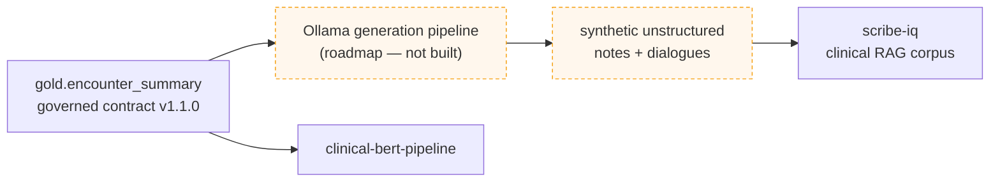

# Downstream & Portfolio

This lakehouse is a **data platform**: it exists to produce one thing the downstream AI projects
can trust — `gold.encounter_summary`, a denormalized, one-row-per-encounter clinical corpus
published under a versioned contract. **One governed, versioned interface, many consumers** — the
point where a data platform earns its keep.

## Why this exists — the portfolio arc

**`scribe-iq` came first.** It proved the clinical-documentation product on a corpus assembled
*heuristically* — Synthea exported as CSV, with clinical notes stitched on from public datasets
(**ACI-Bench, MTSamples, MedSynth**) matched and adapted onto Synthea encounters.

**`scribe-iq-lakehouse` is the principled rebuild** — same domain, done rigorously: the data
foundation moved to **Synthea Coherent (FHIR R4)** and a true medallion lakehouse, with a semver'd,
test-gated Gold contract and two independent engine-native implementations
([ADR-022](adr/022-platform-independent-implementations.md)).

**The loop being closed (roadmap):** an **Ollama** generation pipeline will consume
`gold.encounter_summary` to derive synthetic notes and dialogues — the next-generation corpus for
`scribe-iq`, superseding the original heuristic assembly. The arc: **prototype the product →
industrialize the data foundation → generate the corpus from the governed contract** — building
both the platform and the AI product on top of it.

!!! note "Status — the loop is roadmap"
    `scribe-iq`'s **current** corpus is the heuristic assembly above, **not** this lakehouse. The
    Ollama generation pipeline that turns Gold into `scribe-iq`'s next corpus is planned — not yet
    built. This page describes the intended direction.

## The contract is the interface

Downstream projects pin against the contract's **major** version and treat the lakehouse as a
black box behind it:

- **clinical-bert-pipeline** — the contract's NLP consumer: `soap_note_text` plus the structured
  labels (`active_conditions`, `active_medications`, …) for entity enrichment.
- **Ollama generation pipeline** *(roadmap)* — derives synthetic notes/dialogues from each
  encounter summary, to become…
- **[scribe-iq](https://sandeep-jay.github.io/scribe-iq/)** *(roadmap loop)* — whose next clinical
  RAG corpus is the Ollama-generated text grounded on Gold.

Because the handoff is a **versioned, test-gated contract** ([Corpus Contract](CORPUS_CONTRACT.md)),
the corpus can be rebuilt or re-platformed (LocalLite today, Fabric, later Databricks/AWS) without
the consumers changing — as long as the contract holds. A contract test fails if the code, the
generated JSON Schema, and the docs ever drift apart, so a breaking change can't land silently
without a major-version bump.

## Where this sits in the portfolio

| Project | Role | Relationship |
|---|---|---|
| **scribe-iq-lakehouse** (this) | Data platform / governed corpus | Produces `gold.encounter_summary` |
| [scribe-iq](https://sandeep-jay.github.io/scribe-iq/) | Clinical-documentation AI | Downstream — next corpus via the Ollama loop *(roadmap)* |
| clinical-bert-pipeline | Clinical NLP | Downstream consumer of the contract (notes + labels) |

A separate companion repo,
[`fabric-lakehouse-hls-readmission`](https://github.com/sandeep-jay/fabric-lakehouse-hls-readmission),
tells a different story — migrating a Databricks demo to Fabric, CSV-first — with no code
dependency in either direction.

!!! note "Bidirectional linking"
    The ideal complement to this page is a one-line backlink on the scribe-iq side
    (*"the clinical corpus is produced upstream by scribe-iq-lakehouse"*). That lives in the
    scribe-iq repo and is tracked there as a follow-up.
