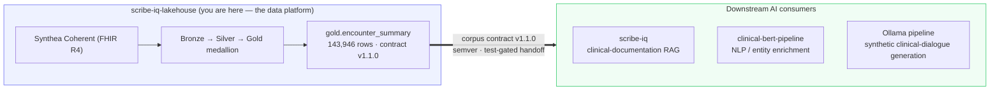

# Downstream & Portfolio

This lakehouse is a **data platform**: it exists to produce one thing the downstream AI projects
can trust — `gold.encounter_summary`, a denormalized, one-row-per-encounter clinical corpus
published under a versioned contract. The point of separating the lakehouse from the apps is
exactly where a data platform earns its keep in production: **one governed, versioned interface,
many consumers.**

## The contract is the interface

Downstream projects pin against the contract's **major** version and treat the lakehouse as a
black box behind it:

- **[scribe-iq](https://sandeep-jay.github.io/scribe-iq/)** — uses the corpus as the retrieval
  substrate for clinical-documentation RAG. This 1,278-patient corpus is the production-pattern
  replacement for an earlier 19-patient development set.
- **clinical-bert-pipeline** — consumes `soap_note_text` plus the structured labels
  (`active_conditions`, `active_medications`, …) for discriminative NLP / entity enrichment.
- **Ollama generation pipeline** — grounds synthetic clinical-dialogue generation on each
  encounter summary (separate spec).

Because the handoff is a **versioned, test-gated contract** ([Corpus Contract](CORPUS_CONTRACT.md)),
the corpus can be rebuilt or re-platformed (LocalLite today, Fabric, later Databricks/AWS) without
the consumers changing — as long as the contract holds. A contract test fails if the code, the
generated JSON Schema, and the docs ever drift apart, so a breaking change can't land silently
without a major-version bump.

## Where this sits in the portfolio

| Project | Role | Relationship |
|---|---|---|
| **scribe-iq-lakehouse** (this) | Data platform / governed corpus | Produces `gold.encounter_summary` |
| [scribe-iq](https://sandeep-jay.github.io/scribe-iq/) | Clinical-documentation AI | **Downstream** consumer (RAG corpus) |
| clinical-bert-pipeline | Clinical NLP | **Downstream** consumer (notes + labels) |

A separate companion repo,
[`fabric-lakehouse-hls-readmission`](https://github.com/sandeep-jay/fabric-lakehouse-hls-readmission),
tells a different story — migrating a Databricks demo to Fabric, CSV-first — with no code
dependency in either direction.

!!! note "Bidirectional linking"
    The ideal complement to this page is a one-line backlink on the scribe-iq side
    (*"the clinical corpus is produced upstream by scribe-iq-lakehouse"*). That lives in the
    scribe-iq repo and is tracked there as a follow-up.
